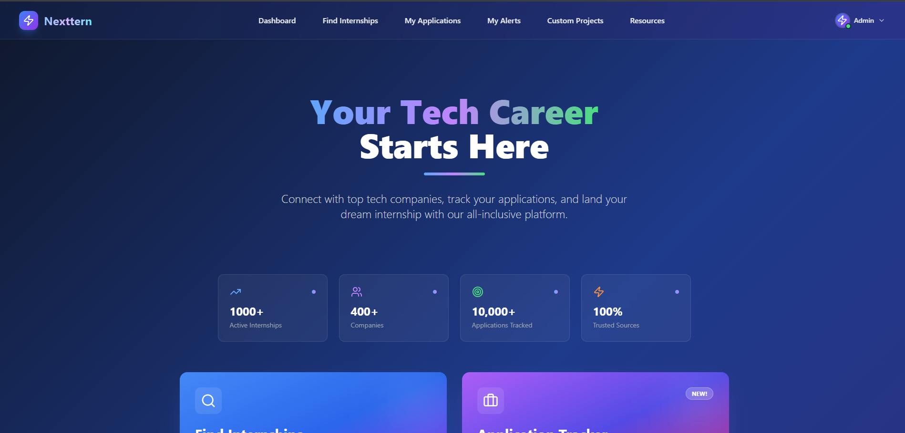
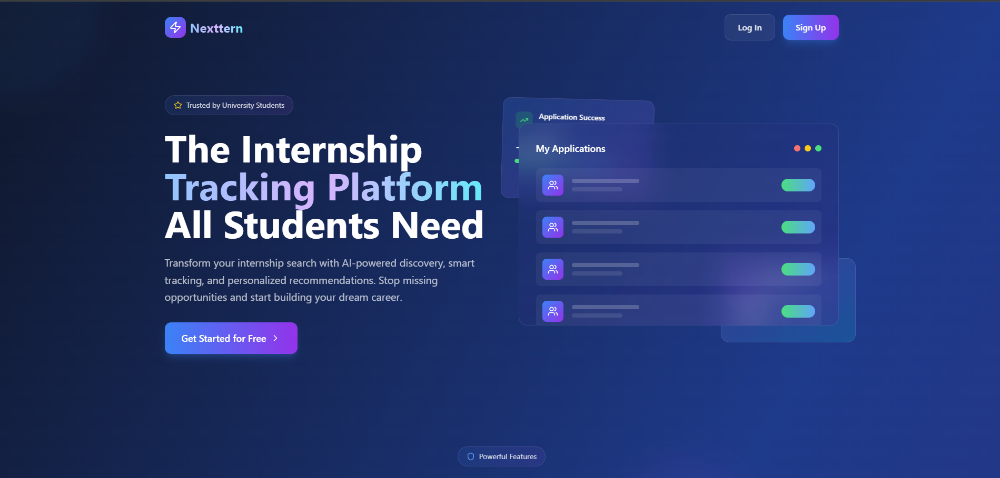

# ⚡ Nexttern

## 🚀 Overview
Nexttern is a full-stack web platform designed to revolutionize the internship search and application process for students and early-career professionals. Built from the ground up as a solo project, Nexttern combines a modern, secure backend with a beautiful, responsive frontend, and leverages cloud-native technologies for scalability and reliability.

---

## 🌟 Key Features

- **Smart Internship Aggregation**: Automatically scrapes and deduplicates internship listings from multiple sources, ensuring users always see the freshest, most relevant opportunities.
- **User Authentication & Profiles**: Secure sign-up/login with Supabase OAuth, JWT-based session management, and customizable user profiles (including avatar upload and storage).
- **Personalized Dashboard**: Users can track applications, save favorite internships, and view tailored recommendations.
- **Project & Resource Management**: Showcase personal projects, manage application materials, and access curated resources for career growth.
- **Real-Time Alerts**: Get notified instantly about new internships, application deadlines, and status updates.
- **Data Integrity**: DynamoDB with deduplication logic and cleanup tools to ensure no duplicate internship URLs are ever stored.
- **Modern UI/UX**: Built with React, Tailwind CSS, and a custom design system for a seamless, mobile-friendly experience.
- **Cloud-Native & Scalable**: AWS Lambda, DynamoDB, EventBridgem SES, and Supabase for a serverless, highly available architecture.

---

## 🛠️ Tech Stack

- **Frontend**: React, Tailwind CSS, JavaScript, Node.js, SQL, Supabase
- **Backend**: Java (Spring Boot), AWS Lambda, DynamoDB, RESTful APIs
- **Database**: DynamoDB (Internships, Last-run-profile), Supabase (Authentication, Applications, Profiles, Resources, Alerts)
- **Authentication**: Supabase OAuth (Google + Traditional Email & Password), JWT
- **Cloud**: AWS Lambda, DynamoDB, EventBridge, SES, Supabase Storage
- **DevOps**: Maven, Docker, GitHub (Git and Github Actions)

## Security & Data Integrity

- All sensitive endpoints require JWT authentication with signature verification
- No secrets or sensitive data are ever logged or exposed
- DynamoDB is protected against duplicate URLs at both the code and data level
- .gitignore is tuned for public safety and best practices
- All environment variables and secrets are managed securely (never hardcoded)

---

## Deployment & Operations

- **CI/CD**: Use GitHub Actions or your preferred CI/CD tool for automated builds and deployments
- **AWS Lambda**: Deploy JARs via AWS Console, CLI, or CI pipeline
- **Environment Variables**: All secrets and config are injected via environment variables (never hardcoded)
- **Monitoring**: Use AWS CloudWatch for Lambda logs and alerts
- **Scaling**: Serverless architecture ensures automatic scaling with demand

---
## Screenshots

### Dashboard

### Landing Page

---

## Author
**Yuvraaj Bains**  
[GitHub](https://github.com/yuvraajbains)

---

## License & Usage
This project is original work by Yuvraj Bains. All rights reserved. No one is permitted to copy, replicate, or redistribute this project in its entirety without explicit permission.

---

## Inspiration
Nexttern was born out of a desire to make the internship search process smarter, faster, and more transparent for students everywhere. Every feature was designed with real user pain points in mind.

---

## Acknowledgements
- Supabase for authentication and storage
- AWS for cloud infrastructure
- Open source libraries and the developer community

---

> _"Built from scratch, with passion and precision."_
